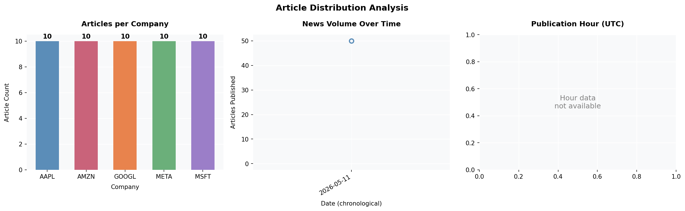
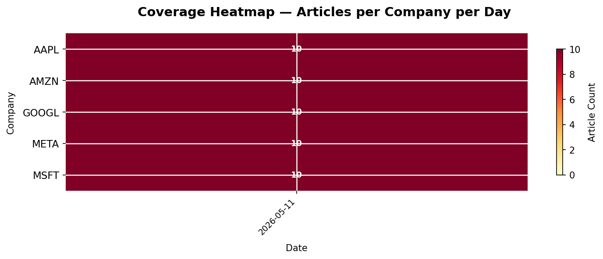

# 📈 Financial News Sentiment Intelligence System

> Real-time NLP system that reads financial news, scores sentiment,
> and predicts next-day stock price direction.

---

## 🚀 What this project does

- Collects live financial news from Yahoo Finance for 5 major companies
- Scores headline sentiment using FinBERT (state-of-the-art financial NLP)
- Combines sentiment signals with stock price data
- Predicts next-day price direction using XGBoost and LSTM
- Serves live predictions via a Streamlit dashboard

## 🏢 Why this matters

This is the exact type of system used at Bloomberg Terminal ($24,000/yr),
Google Finance, and Meta's content ranking pipeline — built from scratch.

## 🛠 Tech stack

`Python` `pandas` `yfinance` `FinBERT` `XGBoost` `FastAPI` `Streamlit` `Docker`

## 📁 Project structure

| File | Description |
|------|-------------|
| `01_data_collection.ipynb` | Phase 1: Live news collection pipeline |
| `all_news.csv` | Raw collected data — 50 articles, 5 companies |

## ✅ Progress
- [x] Project setup — VS Code, venv, folder structure
- [x] Phase 1 — Data collection (50 articles, 5 companies)
- [x] Phase 2 — EDA (6-layer analysis, 4 charts, cleaned dataset)
- [ ] Phase 3 — FinBERT sentiment scoring
- [ ] Phase 4 — Feature engineering
- [ ] Phase 5 — ML modelling
- [ ] Phase 6 — Deployment

## 📊 EDA Charts

